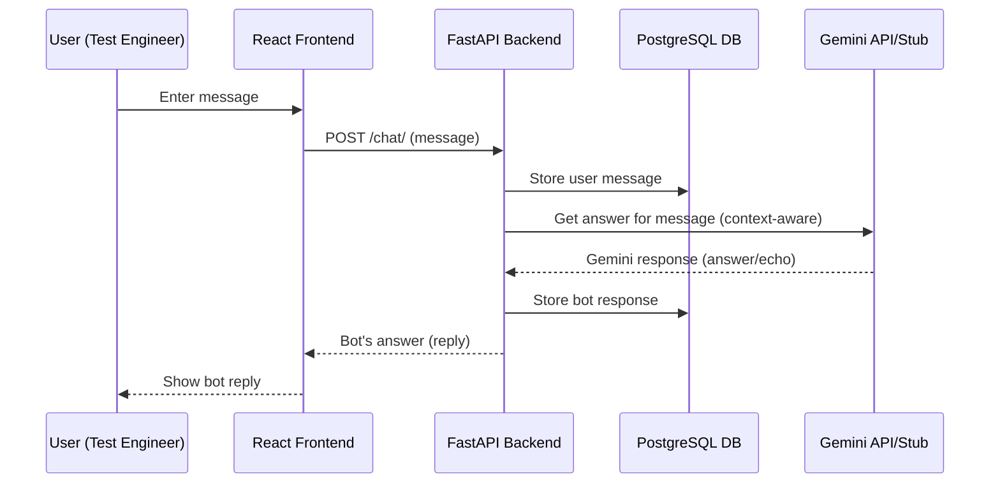

# Product Requirements and Architectural Overview for TestAssist GeminiBot

## Product Requirements

### Overview
TestAssist GeminiBot is a full-stack chatbot application designed for Test Engineers. Its primary goal is to assist users by answering queries related to application testing. The chatbot leverages Google Gemini for natural language processing and retrieves possible answers from an uploaded plain-text file for context-aware response generation.

### Functional Requirements
- Users must be able to interact with the chatbot in real-time via a web interface.
- The chat system should display both user and bot messages clearly.
- Chat history must be accessible, showing past conversations.
- If authentication is enabled, user registration and login must be supported, including profile display.
- The backend should process messages, interact with Gemini, and manage conversations and messages in a PostgreSQL database.
- The bot must be able to reload answer context when a new `.txt` answer file is uploaded via the API.
- All communication between frontend and backend must be over RESTful APIs.
- The system should provide accurate, context-aware answers by using Gemini's NLP and in-context answer file retrieval.
- The frontend should support theme switching (light/dark) and be fully responsive.

### Non-Functional Requirements
- Backend and frontend must be containerized for easy deployment.
- System should support running in both authenticated and anonymous (guest) mode.
- Configurability for database and Gemini API credentials using environment variables.
- Frontend must maintain modern, minimal styling suited for quick adoption and rebranding.

---

## Architectural Overview

### High-Level Structure

The TestAssist GeminiBot consists of three main components:
1. **Frontend (React):** Provides a web UI for users to chat with the bot, see chat history, and (optionally) manage their account.
2. **Backend (FastAPI):** Manages user authentication, processes chat input, interfaces with Gemini (for NLP-powered answers), and interacts with the database.
3. **Database (PostgreSQL):** Stores all persistent data, including users, conversations, and messages. 

### Key Data Flows

- **User Message Handling:**
  - User sends a message via the web UI.
  - Frontend sends API request (`/chat/`) to backend.
  - Backend stores the user's message and full context in the database.
  - Backend invokes the Gemini engine, retrieving a relevant answer (context-aware) using text from the uploaded answers file.
  - GeminiBot's reply is stored in the database and returned to the frontend.
- **Chat History Retrieval:**
  - Frontend requests `/chat/history` to retrieve past chats for the user (or guest).
  - Backend returns conversation objects with associated messages.
- **Answer File Update:**
  - An authorized user/admin uploads a new answer file (`/files/answers`).
  - Backend reloads context for Gemini in real time.

### Gemini API Integration

- The Gemini logic is encapsulated as a Python class `GeminiAPI` in `backend_fastapi/src/api/main.py`.
- At startup, the backend loads possible answers from a `.txt` file (path configurable via env var).
- When processing a user message, the backend selects a relevant answer based on fuzzy matching with user query and chat history, or falls back to an echo or default answer.
- Google Gemini API key is intended to be provided via environment variables; code architecture supports swapping the stub for real Gemini integration.

### Database Integration

- Built on PostgreSQL (`database_container`).
- Tables: `users`, `conversations`, `messages`.
- Backend uses SQLAlchemy ORM for all database operations and auto-migrates schema at startup.
- Auth is optional and can be toggled via configuration.

### Deployment Structure

- Each container (database, backend, frontend) runs independently and may be orchestrated via Docker Compose.
    - The database container is defined with init SQL scripts and default credentials (should be overridden in production).
    - Backend is configured to connect to the database using environment variables for host, port, credentials, and answer file configuration.
- All containers communicate on known ports; frontend connects to backend URL via REST, and backend connects to the database.

---

## Main Components

### Frontend (`frontend_reactjs`)
- **App.js:** Core UI logic, API calls, chat handling, theming, and responsive design.
- State and hooks manage messages, input, authentication, and visual state.
- Integration points for chat APIs and user profile/token storage.
- Styles are handled in `App.css` and inline with React.

### Backend (`backend_fastapi`)
- **main.py:** All REST endpoints, models, DB logic, authentication flow, Gemini integration.
    - `/chat/` (POST): Send and process a user message.
    - `/chat/history` (GET): List all prior conversations and messages.
    - `/files/answers` (POST): Upload new context file for Gemini answers.
    - `/auth/*`: Endpoints for login, signup, user profiles (if enabled).
- Authentication toggles between JWT-secured and stateless guest mode.
- Gemini answer engine hot-reloads answer context on file upload.

### Database
- Initialization and schema managed by Dockerfile and `init.sql`.
- Exposes tables for users, conversations, and messages.
- Allows full chat and user history persistence.

---

## System Diagrams

### System Deployment Diagram

```mermaid
flowchart LR
    Client[Web Browser UI<br/>React (frontend_reactjs)]
      --REST (HTTP)--> 
    Backend[FastAPI Backend<br/>backend_fastapi]
      --SQL over TCP--> 
    Database[(PostgreSQL DB<br/>database_container)]

    Backend --Uploads .txt answer file--> Database
    Client --Uploads .txt answer file via REST--> Backend
    Backend -.-> GeminiAPI["Gemini API (or local stub)<br/>Google Gemini (planned)"]
    Client <-- Chat/UI Events --> Client
```

### Main Data Flow Diagram



### Component Overview Diagram

```mermaid
flowchart TB
    subgraph Frontend [Frontend (React)]
        UI[Chat UI & State Mgmt<br/>App.js]
        Theme[Theme & Style<br/>App.css]
    end
    subgraph Backend [Backend (FastAPI)]
        Endpoints[REST API Endpoints<br/>main.py]
        ORM[Database ORM (SQLAlchemy)]
        GeminiInt[Gemini API Stub/Integration]
    end
    subgraph DB [Database (PostgreSQL)]
        Users[(users)]
        Convos[(conversations)]
        Messages[(messages)]
    end

    UI -- REST calls --> Endpoints
    Endpoints -- ORM --> Users
    Endpoints -- ORM --> Convos
    Endpoints -- ORM --> Messages
    Endpoints -- Gemini context --> GeminiInt
    Endpoints -- answer context load --> GeminiInt
    Endpoints <-- answer upload --> UI
    DB -. data persistence .- Users
    DB -. data persistence .- Convos
    DB -. data persistence .- Messages
```

---

## Interfaces

- **Frontend to Backend:** REST API, covering `/chat/`, `/chat/history`, `/auth/*`, and `/files/answers`.
- **Backend to Database:** SQLAlchemy ORM manages all DB reads/writes.
- **Backend to Gemini:** Internal Python API (stub today, ready for real Gemini API).
- **Admin/API User to Backend:** File upload interface for updating chatbot answer file.

---

## Notes

- This architecture is modular, enabling future upgrades such as real Gemini integration, external authentication providers, or advanced scaling.
- The backend API is fully documented via OpenAPI/Swagger (`/docs` endpoint).
- The chat engine supports in-context retrieval and is designed for Test Engineer workflows.

---

**Sources:**  
- backend_fastapi/src/api/main.py  
- frontend_reactjs/src/App.js

